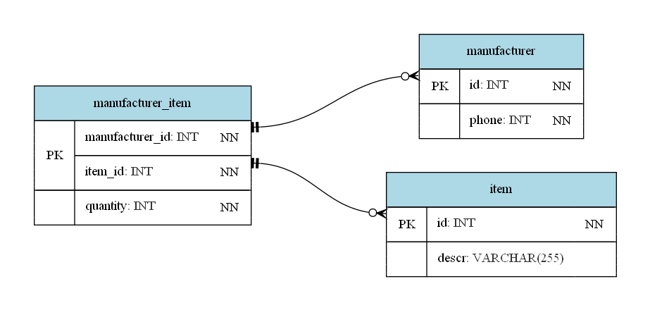

# @sql-vis [](https://badge.fury.io/js/sql-vis)



## Installation:

You should have `graphviz` installed.

### MacOS

```bash
> brew install graphiz
```

### Windows

```bash
> choco install graphviz
```

Other installatiom methods can be found on `Graphviz` [website](https://graphviz.org/download/)

## Usage:

Script watches for changes in your sql and updates png ons save.

```bash
> npx sql-vis <filename.sql> <output-image.png>
```

## Example SQL:

```sql
CREATE TABLE item (
  id INT NOT NULL,
  PRIMARY KEY (id),
  descr VARCHAR(255)
);

CREATE TABLE manufacturer_item (
  item_id INT NOT NULL,
  manufacturer_id INT NOT NULL,
  quantity INT NOT NULL,
  PRIMARY KEY (item_id, manufacturer_id),
  FOREIGN KEY (item_id) REFERENCES item(id),
  FOREIGN KEY (manufacturer_id) REFERENCES manufacturer(id)
);

CREATE TABLE manufacturer (
  id INT NOT NULL,
  PRIMARY KEY(id),
  phone INT NOT NULL
);
```

## Supported SQL

### Statements

`CREATE TABLE <tableName> ( ... );` only since the goal of this project is to visualize table definitions in Martin's ERD notation.

### Types:

- `VARCHAR(<integer>)`
- `INT`
- `TEXT`
- `DATETIME`
- `DECIMAL(<integer>, <integer>)`
- `DATE`

### Table constraints

- `PRIMARY KEY (<columnName>)`
- `FOREIGN KEY (<selfColumn>) REFERENCES <foreignTable>(<foreignColumn>) <MANDATORY?>`

  > `MANDATORY` is project specific keyword used to mark that relationship is mandatory for referenced table

### Column modifiers

- `NOT NULL`
- `AUTO INCREMENT`

### One more thing

- Trailing commas are supportedonly inside `CREATE TABLE` :(
- Semicolomns are required after `CREATE TABLE` statement

### How Do They Do It

Tool uses `Peg.js` to parse SQL abstract syntax tree, set of custom rules for deriving relationship types, and custom `dot` generator. The source code split in corresponding files. There are no docs ot comments for now, but you are always free to contribute.
